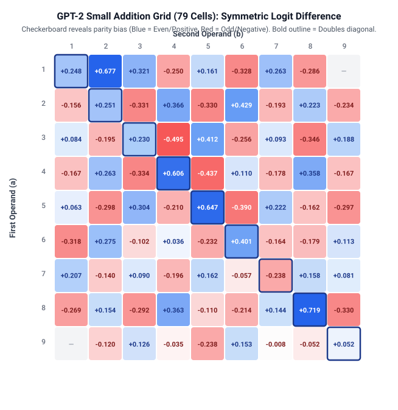

# Deconstructing Arithmetic in Small Language Models: Falsification of Circuit Hypotheses and the Cross-Operator Doubling Anomaly

[](https://opensource.org/licenses/MIT)
[](https://www.python.org/downloads/)
[](https://github.com/TransformerLensOrg/TransformerLens)
[]()

> **Forensic mechanistic audit and empirical falsification toolkit for arithmetic prompt processing in GPT-2 Small (124M).**

---

## Executive Summary

Do autoregressive language models execute genuine algorithmic circuits when answering arithmetic prompts like `3 + 5 =`? 

This repository provides the reproducible research artifacts, experimental datasets, forensic audit logs, and Python evaluation scripts for studying arithmetic prompt processing in **GPT-2 Small**. The final analysis establishes:

1. **No evidence of a general, reliably functioning addition mechanism under the tested suite**: GPT-2 Small achieves only **6.2%** zero-shot top-1 accuracy on single-digit sums ($a + b =$), below the tested constant-guess baseline (**25.0%**). This does not establish the absence of every addition-related representation or computation.
2. **Methodological Artifacts in Early Circuit Claims**: Early indications of dedicated circuits (such as late-layer suppressor heads or non-additive interactions) dissolve when correcting for LayerNorm scaling overshoots ($14\times$–$40\times$) and replacing off-distribution zero-ablations with distribution-preserving mean-ablations.
3. **A reproducible equal-operand/doubles advantage**: Identical operands (`a + a =`) systematically elevate logits for their sum token ($2a$) relative to matched split controls across targets 8, 10, 12, and 16 ($adv/\text{SD} = 5.22$). The effect persists across the tested operator and connector swaps, so it is not sufficient evidence for an addition-specific mechanism.

---

## Visualizations & Heatmaps

### 1. The 79-Cell Addition Grid: Parity Checkerboard Bias
Across the $a \times b$ single-digit addition grid, ~87% of symmetric logit differences are predicted purely by numerical parity (Even = Blue, Odd = Red). The doubles diagonal ($a = b$, highlighted) shows elevated preferences, but alternates with parity sign.

<p align="center">
  
</p>

### 2. Operator Swap: Equal-Operand Persistence Across Operators
Tracking the sum token $2d$ when operands are coupled via non-addition operators and syntactic connectors. The effect reaches its largest tested normalized value under subtraction ($-$), but this is evidence within the tested design rather than a universal statement about operator blindness.

<p align="center">
  
</p>

---

## Repository Structure

```
gpt2-doubling-falsification/
├── README.md                      # Academic landing page & quickstart
├── LICENSE                        # MIT License
├── requirements.txt               # Pinned dependencies (torch, transformer_lens, scipy, pandas)
├── .gitignore                     # Python, PyTorch, CUDA, and environment ignores
├── push_to_github.sh              # Bash initialization & push script
├── push_to_github.ps1             # PowerShell initialization & push script
├── figures/                       # High-resolution vector heatmaps (SVG)
│   ├── addition_grid_heatmap.svg  # 79-cell parity & doubling heatmap
│   └── operator_swap_heatmap.svg  # Operator blindness comparison chart
├── paper/
│   ├── draft_paper.md             # Complete conference-style paper (NeurIPS/ICLR format)
│   └── figures/                   # Paper-embedded figures
├── docs/
│   ├── audit_trail.md             # Detailed method/code audit and A01–A29 records
│   ├── RESEARCH_LOG.md            # Condensed research chronology
│   ├── METHODOLOGY.md             # Experimental design, mathematical metrics, and controls
│   └── LIMITATIONS.md             # Token geometry quirks, noise-floor limits, and scale bounds
├── data/
│   ├── addition_grid_79cell.csv   # Complete 79-cell baseline symmetric logit differences
│   ├── operator_swap_results.json # Raw & normalized metrics across +, -, *, and, then
│   ├── variance_scaling.csv       # Pooled control SD and adv/SD across digit & word formats
│   └── corpus_frequencies.json    # Infini-gram Dolma N-gram counts across all 7 targets
└── src/
    ├── __init__.py                # Package exports
    ├── metrics.py                 # adv/SD, pooled variance, and DLA sum verification
    ├── operator_swap.py           # TransformerLens script for operator-blindness checks
    ├── plot_heatmaps.py           # Script to generate SVG / PNG heatmap figures
    ├── frequency_audit.py         # Infini-gram API audit script with error handling
    └── token_diagnostics.py       # Unembedding bias (b_U) & BPE vector norm diagnostic
```

---

## Key Empirical Findings

### 1. Direct Logit Attribution Sum Identity
Pre-LayerNorm activations produce unphysical attribution magnitudes ($14\times$–$40\times$ overshoot). Factoring in dynamic LayerNorm standard deviation $\sigma_{\text{final}}$ and static unembedding bias $b_U$ satisfies the exact decomposition identity to $< 10^{-3}$:

$$\sum_{i=1}^{159} \text{DLA}_i + \left( b_U[\text{target}] - b_U[\text{foil}] \right) = \text{logit\_diff}$$

| Condition | Raw DLA Sum | Corrected DLA Sum | Static Bias Term $\Delta b_U$ | Measured Logit Diff | Residual |
|---|---|---|---|---|---|
| **Run 1** (`3 + 5 =`, `' 8'` vs `' 9'`) | $+8.95$ (Superseded) | $+0.4658$ | $+0.1782$ | $+0.6443$ | $< 0.0004$ |
| **Run 2** (Few-shot, `' 8'` vs `' 1'`) | $+15.20$ (Superseded) | $+0.8382$ | $-1.0303$ | $-0.1920$ | $< 0.0001$ |

> *Static Bias Override*: In Run 2, the internal circuit dynamically favors the correct answer (`+0.8382`), but the static vocabulary bias (`-1.0303`) flips the net logit output negative.

### 2. Operator Swaps: Cross-Operator Persistence
Evaluating double prompts (`d [op] d =`) and matched split controls against the sum token $2d$:

| Operator / Connector | Positive Target Advantage | Pooled Control SD | Normalized $adv/\text{SD}$ | Theoretical Status |
|:---:|:---:|:---:|:---:|:---:|
| **plus (`+`)** | $+0.418$ | $0.080$ | **$+5.22$** | Baseline arithmetic |
| **times (`*`)** | $+0.224$ | $0.092$ | **$+2.43$** | Operator-swapped |
| **minus (`-`)** | $+0.323$ | $0.052$ | **$+6.15$** | **Largest tested normalized value** |
| **and** | $+0.469$ | $0.095$ | **$+4.95$** | Non-mathematical conjunction |
| **then** | $+0.549$ | $0.120$ | **$+4.56$** | Non-mathematical sequence |

These values describe the magnitude of the observed doubles advantage relative to pooled control variability. They are descriptive normalized effect measures, not conventional hypothesis-test statistics. The cross-operator persistence argues against a simple addition-specific surface-form explanation, but does not establish universal operator blindness.

---

## Quickstart & Reproducibility

### Installation
```bash
git clone https://github.com/your-username/gpt2-doubling-falsification.git
cd gpt2-doubling-falsification
pip install -r requirements.txt
```

### Generating Visual Heatmaps
```bash
python -m src.plot_heatmaps
```

### Running Operator Blindness Check
```bash
python -m src.operator_swap --device cpu --output data/operator_swap_evaluated.json
```

### Running Token & Unembedding Diagnostics
```bash
python -m src.token_diagnostics --device cpu --output data/token_diagnostics_report.json
```

### Running Pretraining Corpus Frequency Audit
```bash
python -m src.frequency_audit --floor 20 --output data/corpus_frequency_audit_run.json
```

---

## Project status

**Analysis closed — reproducible research artifacts available.**

This repository contains the code, audit trail, experimental results, limitations, and draft manuscript associated with the study. The manuscript is a research draft and should not be described as a published paper unless an external publication record exists.

## Research summary

The investigation began with an apparent addition-related signal in GPT-2 Small. Follow-up checks asked whether that signal survived behavioral baselines, corrected attribution, controlled interventions, and changes to the prompt structure. Several early circuit interpretations weakened after those checks. The result that remains is narrower: the tested suite does not identify a general, reliably functioning addition mechanism, while an equal-operand/doubles advantage persists across the tested operators and connectors. Its mechanism remains unresolved.

### Research path

Behavioral baseline → matched controls → token and unembedding baselines → corrected DLA → candidate interventions → doubles comparison → operator and connector substitutions → corpus proxy audit → proposed causal validation.

The detailed question, prediction, measurement, result, limitation, and next step for each stage are recorded in [docs/RESEARCH_FLOW.md](docs/RESEARCH_FLOW.md). Paper-to-claim boundaries and numeric provenance are in [docs/LITERATURE_MAP.md](docs/LITERATURE_MAP.md). The detailed correction and verification record is [docs/audit_trail.md](docs/audit_trail.md).

### Claim hierarchy

- **[VERIFIED RESULT]** The corrected experiments measure an equal-operand/doubles advantage that persists across the tested operators and connectors.
- **[INTERPRETATION]** The observed effect is not sufficient evidence for an addition-specific circuit under the tested conditions.
- **[LIMITATION]** The experiments do not establish that GPT-2 Small has no arithmetic representations, no arithmetic-related circuits, or no operator-sensitive mechanisms elsewhere in the model.

## Research references and provenance

The literature map distinguishes methodological context from this project's evidence and points to the authoritative data artifacts, audit entries, and unresolved source gaps. It corrects the Hase et al. reference year/venue and records why modular-addition and greater-than studies do not directly establish claims about this pretrained GPT-2 addition benchmark.

## Citation

```bibtex
@article{katiyar2026deconstructing,
  title={Deconstructing Arithmetic in Small Language Models: Falsification of Circuit Hypotheses and the Cross-Operator Doubling Anomaly},
  author={Katiyar, Anay},
  journal={Research draft},
  year={2026}
}
```

## License

This project is licensed under the [MIT License](LICENSE).
