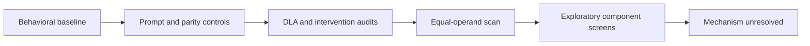

# Arithmetic Prompt Processing in GPT-2 Small

[](https://opensource.org/licenses/MIT)
[]()

This project examines whether GPT-2 Small (124M parameters) uses a general addition-specific mechanism on simple decimal addition prompts. The tested experiments do not establish such a mechanism. They identify a target-dependent preference for equal-operand prompts under selected conditions, but its cause remains unresolved. This manuscript is a research draft and has not been peer reviewed.

**Explore:** [Key findings](#findings) · [Research path](#research-path) · [Interactive figures](#interactive-figures) · [Run the notebook](#reproduce) · [Evidence and audits](#evidence-and-scope)

## Research path



Follow the links for the [methods](docs/METHODOLOGY.md), [limitations](docs/LIMITATIONS.md), [research flow](docs/RESEARCH_FLOW.md), and [audit trail](docs/audit_trail.md).

## Findings

- **Behavioral baseline:** top-1 accuracy was 2/36 (5.56%) on the all-pairs zero-shot set and 2/32 (6.25%) on the held-out zero-shot set. The best constant guess on the held-out set scored 8/32 (25%). These are separate cohorts.
- **Addition grid:** parity predicted the sign of the measured logit difference in 68/79 rows overall, 63/64 rows for sums ≤13, and 5/15 rows for sums ≥14. Rows share target sums and are not independent.
- **Equal operands:** the digit+digit scan reports a mean advantage of +0.247 (SE 0.102), positive at 6 of 7 targets. The effect is target-dependent; the mechanism is not identified. The normalized `adv/SD` ratio is descriptive, not a significance test.
- **Corpus comparison:** the corrected seven-target analysis found no significant association for joint counts (ρ=+0.46, p=.294) or conditional counts (ρ=−0.14, p=.760). The earlier ρ=+0.82 result is retracted.

These findings apply to the tested model, prompts, targets, and controls. They do not show that GPT-2 Small lacks all arithmetic-related representations or computations.

## Interactive figures

The script-generated figures summarize the addition grid and operator comparison:


Open the saved interactive HTML figures:

- [Residual-stream patching](figures/colab/residual_stream_patching.html)
- [Attention-head patching](figures/colab/attention_head_patching.html)
- [L9H9 attention pattern](figures/colab/l9h9_attention_pattern.html)
- [L10H2 attention pattern](figures/colab/l10h2_attention_pattern.html)

The notebook can also be opened in Colab:

[](https://colab.research.google.com/github/anaykatiyar-lang/mechanistic_interpretability/blob/main/notebooks/mechanistic_interpretability.ipynb)

Figure sources and measurement scope are described in [docs/FIGURES.md](docs/FIGURES.md). Attention views are descriptive; patching displays should be read with the notebook's clean and corrupt baselines.

<details>
<summary>What the figures can and cannot show</summary>

The patching figures show normalized recovery for the tested prompts. Values below zero or above one are possible and should be interpreted with their baselines. Attention patterns show where a head attends; by themselves, they do not establish causal routing or arithmetic specificity. The L9H9 path-patching result remains unverified ([audit A12](docs/audit_trail.md#a12-invalid-path-patching-l9h9)).

</details>

## Reproduce

The dependency ranges in `requirements.txt` are not a lockfile. The original runtime environment was not recorded, so exact historical package versions cannot be asserted.

```bash
git clone https://github.com/anaykatiyar-lang/mechanistic_interpretability.git
cd mechanistic_interpretability
python -m pip install -r requirements.txt
```

Regenerate the two SVG figures from the committed grid and operator summary:

```bash
python -m src.plot_heatmaps
```

The operator comparison and corpus query scripts are documented in their module help and write separate output files by default. The corpus audit requires network access to Infini-gram. The notebook uses GPT-2 Small through TransformerLens and may require a GPU for practical execution.

## Evidence and scope

The notebook contains saved outputs for the behavioral benchmark, DLA, interventions, operator comparisons, and corpus query. These outputs document the reported runs but have not all been independently regenerated from a clean environment. The committed digit+digit scores support the dense-scan table; formatted prompt-level control scores and individual corpus API responses are not available. The single-operand comparison remains unverified. See [Study limitations](docs/LIMITATIONS.md), the [research flow](docs/RESEARCH_FLOW.md), the [literature-to-claim map](docs/LITERATURE_MAP.md), and the [audit trail](docs/audit_trail.md) for the detailed evidence and correction record.

<details>
<summary>Audit highlights</summary>

| Audit | Correction or current scope |
|---|---|
| DLA scaling and unembedding bias | Apply final LayerNorm scaling and include the output bias term when reconciling logit differences. |
| Zero-ablation | Treat off-distribution zero-ablation cautiously; the mean-ablation control reduced the L11H0 shift from +0.0658 to +0.0013. |
| Position-1 control | Corrected the operand corruption rule; the earlier positive reading was leakage. |
| Operator patching | The original metric lacked a corrupt baseline, so the strong falsification claim is not established. |
| Corpus-frequency result | The earlier ρ=+0.82 result is retracted; the corrected seven-target comparison was not significant. |
| Candidate components | `10_mlp_out`, L9H9, and L10H2 remain exploratory; they are not a confirmed circuit. |

See the [full audit trail](docs/audit_trail.md) for the entries and source values.

</details>

## Repository contents

- `data/` — prompt scores, aggregate tables, and corpus summaries.
- `docs/` — methodology, study limitations, literature mapping, research flow, and audit records.
- `figures/` — generated SVGs and interactive notebook figures.
- `notebooks/` — analysis notebook with saved outputs.
- `paper/draft_paper.md` — manuscript draft.
- `src/` — metric definitions, plotting, operator comparison, and corpus audit scripts.

## AI assistance

Claude Sonnet 5.5, ChatGPT, and Gemini 3.1 Pro were used to stress-test the analysis by questioning assumptions and identifying potential weaknesses. Their suggestions were treated as prompts for review, not as evidence; the author is responsible for the data, analysis, and conclusions.
