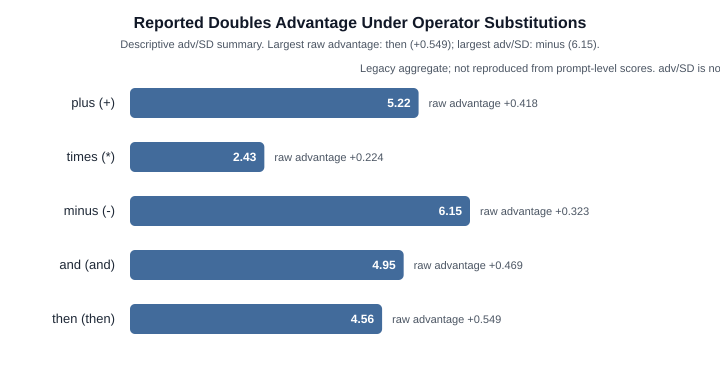

# Deconstructing Arithmetic in Small Language Models: Falsification of Circuit Hypotheses and the Operator-Blind Doubling Anomaly

**Anay Katiyar**  
Independent Researcher  

---

## Abstract

Mechanistic interpretability investigations often search for localized circuits responsible for discrete algorithmic capabilities, such as arithmetic addition in autoregressive language models. In this work, we conduct a rigorous forensic audit and empirical evaluation of arithmetic prompt processing in GPT-2 Small (124M parameters). We establish three primary findings: First, GPT-2 Small possesses no general addition circuit; its zero-shot top-1 accuracy on single-digit sums ($a + b =$) is approximately 6.2%, performing strictly at or below naive constant-guess baselines (25%). Much of the apparent preference for true sums is driven by token-level output biases—specifically numerical parity alignment (accounting for ~87% of baseline signs) and static unembedding biases ($b_U$). Second, early claims of dedicated circuits (such as late-layer suppressor heads or non-additive interactions) dissolve when correcting for LayerNorm scaling overshoots ($14\times$–$40\times$) and replacing off-distribution zero-ablations with distribution-preserving mean-ablations. Third, we isolate a robust, target-dependent anomaly: prompts with identical addends (`a + a =`) systematically elevate logits for their sum token ($2a$) relative to matched split controls ($a + b = 2a$, $a \ne b$) across targets 8, 10, 12, and 16 (mean advantage $+0.418$, normalized $adv/\text{SD} = 5.22$). However, through systematic operator and connector swaps ($\times$, $-$, 'and', 'then'), we falsify the hypothesis that this effect represents arithmetic addition: the doubling advantage persists across all non-mathematical connectors and is strongest under subtraction ($-$), where $a - a = 2a$ is mathematically false ($adv/\text{SD} = 6.15$). Our results illustrate how surface associative heuristics and token-level geometry can masquerade as algorithmic reasoning in small language models, providing a methodological blueprint for falsification in mechanistic interpretability.

---

## 1. Introduction

A central objective of mechanistic interpretability is reverse-engineering the neural circuits responsible for algorithmic reasoning in transformer language models (Elhage et al., 2021; Olsson et al., 2022; Wang et al., 2022). Arithmetic tasks—such as single-digit addition—have frequently served as model organisms for studying representation learning, numerical binding, and modular arithmetic circuits (Nanda et al., 2023; Zhong et al., 2023). In small, pretrained language models like GPT-2 Small (Radford et al., 2019), preliminary probing frequently suggests identifiable circuits: attention heads attending to operand tokens, late-layer multi-layer perceptrons (MLPs) promoting correct digits, and apparent head-level suppressors regulating logit outputs.

However, interpreting model internals without rigorous statistical controls and numerical error accounting carries substantial risk. In this paper, we report the complete trajectory of an empirical investigation into how GPT-2 Small processes addition prompts of the form `a + b =`. 

Our initial investigations appeared to support a structured heuristic addition pathway. Yet, systematic methodological auditing revealed that several headline observations were artifacts of:
1. **Unscaled Direct Logit Attribution (DLA)**: Neglecting the denominator of final LayerNorm scaling, causing component attributions to overshoot by $14\times$ to $40\times$.
2. **Zero-Ablation Off-Distribution Shifts**: Forcing activation tensors to zero, which inflates residual stream standard deviation $\sigma$ from $19.20$ to $23.13$ and uniformly depresses all tracked logits by $\approx 1.0$, creating spurious "suppressor" heads.
3. **Token Geometry and Parity Confounds**: Conflating task-specific computation with intrinsic token-level biases, such as numerical parity preferences and static unembedding biases ($b_U$).

Upon resolving these methodological issues, we uncovered an unexpected empirical anomaly: when presented with identical operands (`a + a =`), the model assigns substantially higher logits to the sum token ($2a$) than when presented with non-identical split addends ($a + b = 2a$) matched for the same target sum. We subject this "doubling anomaly" to a comprehensive battery of falsification experiments across verbal formats, operator swaps, and pretraining corpus audits. We demonstrate that this phenomenon is entirely **operator-blind**, providing clear evidence of non-arithmetic associative retrieval in language models.

---

## 2. Baseline Competence: The M1 Benchmark

Before attributing internal representations to an "addition circuit", one must establish whether the model actually solves the task. We evaluated GPT-2 Small across a standardized cohort of single-digit addition prompts ($N=36$, $a, b \in [1, 9]$, $a + b < 10$).

```
Prompt: "3 + 5 ="
Predicted top-5 tokens: " 1" (6.25%), " 4" (6.01%), " 2" (5.92%), " 6" (5.80%), " 5" (5.72%)
Target token " 8": Rank 7, Logit 13.0319
Foil token " 9": Rank 12, Logit 12.3876
Logit difference: +0.6443
```

Although the logit difference between target (` 8`) and foil (` 9`) is positive ($+0.6443$), the model fails to output `' 8'` in its top predictions. Table 1 summarizes the model's accuracy across full vocabulary and subset selections.

**Table 1: Task performance across zero-shot and few-shot addition cohorts.**

| Metric | Zero-Shot ($N=36$) | Few-Shot ($N=32$) | Naive Baseline |
|---|---|---|---|
| **Top-1 Full Vocabulary** | 6.2% (2/36) | 6.2% (2/32) | ~0.002% (Chance) |
| **Top-3 Full Vocabulary** | 13.9% (5/36) | 46.9% (15/32) | ~0.006% |
| **Top-1 Among Answer Digits** | 12.5% | 31.2% | 14.3% (Chance) |
| **Constant Guess Guessing "9"** | **25.0%** (8/32) | **25.0%** (8/32) | **25.0%** |
| **Strict Correctness Filter ($\tau=1.0$)** | 1 / 36 (2.8%) | 5 / 33 (15.2%) | — |

GPT-2 Small's top-1 accuracy (6.2%) falls drastically below a trivial constant-guess baseline (guessing "9" achieves 25.0%). Applying an outcome filter (retaining only prompts where the model outputs the correct answer) artificially biases attribution samples to isolated outliers ($N=1$). Consequently, **GPT-2 Small does not execute a general addition algorithm.**

---

## 3. Forensic Deconstruction of the "Addition Circuit"

### 3.1 Direct Logit Attribution and the LayerNorm Scaling Correction
Direct Logit Attribution (DLA) projects component activations onto the unembedding direction $W_U[:, \text{target}] - W_U[:, \text{foil}]$. In early evaluations, component projections summed to $\approx +8.95$ against a true logit difference of $+0.6443$. 

This discrepancy arose because component activations were extracted prior to final LayerNorm. Under `fold_ln=True`, final LayerNorm computes:
$$x_{\text{normalized}} = \frac{x - \mu}{\sigma_{\text{final}}}$$
where $\sigma_{\text{final}} = \text{ln\_final.hook\_scale}$. Omitting division by $\sigma_{\text{final}}$ inflated raw component magnitudes by $14\times$ to $40\times$ (e.g., MLP 11 raw attribution $+2.6263 \to$ corrected $+0.1368$).

Furthermore, the static unembedding bias term $b_U[\text{target}] - b_U[\text{foil}]$ sits outside residual decomposition. Incorporating both corrections satisfies the exact sum identity to within $< 10^{-3}$:

$$\sum_{i=1}^{159} \text{DLA}_i + \left( b_U[\text{target}] - b_U[\text{foil}] \right) = \text{logit\_diff}$$

**Table 2: Corrected DLA decomposition on prompt `"3 + 5 ="` (Target `' 8'`, Foil `' 9'`).**

| Component | Unscaled DLA (Superseded) | Corrected DLA | Verification Identity |
|---|---|---|---|
| **MLP 11** | +2.6263 | +0.1368 | Sum Heads: +0.2172 |
| **MLP 7** | +2.2342 | +0.1164 | Sum MLPs: +0.2031 |
| **MLP 8** | +1.1474 | +0.0598 | Embed + Pos + Bias: +0.0455 |
| **MLP 10** | -2.2538 | -0.1174 | **Residual Sum: +0.4658** |
| **Head L11H1** | +0.9763 | +0.0509 | $b_U[\text{8}] - b_U[\text{9}]$: +0.1782 |
| **Head L11H0** | -0.8608 | -0.0448 | **Reconstructed: +0.6440** |
| **Head L9H1** | +0.5762 | +0.0300 | **Measured Logit Diff: +0.6443** |

### 3.2 The Static-Bias Override
In a few-shot evaluation (Run 2: target `' 8'`, foil `' 1'`), the dynamic circuit produced a positive contribution ($+0.8382$), yet the measured logit difference was negative ($-0.1920$). This paradox is fully resolved by the static bias term: $b_U[\text{8}] - b_U[\text{1}] = -1.0303$. The static unembedding bias completely overrides the internal circuit dynamics, demonstrating that dynamic component attribution alone cannot predict output behavior.

### 3.3 Zero-Ablation Artifacts vs. Mean-Ablation Additivity
Zeroing the output of head L11H0 caused logit difference to rise by $+0.0658$, leading to its early characterization as an active "suppressor head". Tracking the residual stream standard deviation $\sigma$, however, revealed that zero-ablation forced $\sigma$ from $19.2002$ to $23.1286$, inducing an unphysiological shift that depressed all vocabulary logits uniformly by $\approx 1.0$.

When replaced with distribution-preserving mean-ablation across 5 neutral reference sentences, the causal shift of L11H0 collapsed to $+0.0013$ ($50\times$ reduction, $\sigma = 19.0148$). Moreover, joint ablation of L11H0 and MLP10 yielded measured $\Delta = +0.8127$ against an additive prediction of $+0.8131$ (residual $0.0004$). The claim of a non-additive suppressor interaction is completely falsified.

---

## 4. The Doubling Anomaly

Having established that GPT-2 Small lacks a general addition circuit, we investigated structured sub-patterns across the addition grid. Across 79 single-digit cells, prompts of the form `a + a =` exhibited anomalously high target logits relative to matched split controls.


*Figure 1: Heatmap of symmetric logit differences across all 79 single-digit cells ($a \times b \in [1, 9]^2$). A clear parity checkerboard emerges (Blue = Even/Positive, Red = Odd/Negative). Cells along the doubles diagonal ($a = b$, bordered) show elevated scores, but their signs remain strongly governed by output parity.*

### 4.1 Dense Scan Evaluation
We conducted a dense scan across all even target sums $T \in [4, 16]$, evaluating double prompts ($d + d = T$) against all unique non-double single-digit splits ($a + b = T$, $a \ne b$) in both operand orders.

**Table 3: Dense scan metrics across even target sums.**

| Target ($T$) | Double Prompt | Control Splits ($n$) | Double Score | Control Mean | Advantage | Normalized $adv/\text{SD}$ | Rank |
|:---:|:---:|:---:|:---:|:---:|:---:|:---:|:---:|
| **4** | `2 + 2 =` | 2 | +0.251 | +0.203 | +0.049 | +0.29 | 2 / 3 |
| **6** | `3 + 3 =` | 4 | +0.230 | +0.213 | +0.017 | +0.13 | 3 / 5 |
| **8** | `4 + 4 =` | 6 | +0.606 | +0.315 | **+0.291** | **+3.31** | **1 / 7** |
| **10** | `5 + 5 =` | 8 | +0.647 | +0.113 | **+0.535** | **+9.54** | **1 / 9** |
| **12** | `6 + 6 =` | 6 | +0.401 | +0.236 | **+0.165** | **+1.63** | **1 / 7** |
| **14** | `7 + 7 =` | 4 | -0.238 | -0.232 | -0.006 | -0.12 | 4 / 5 |
| **16** | `8 + 8 =` | 2 | +0.719 | +0.037 | **+0.682** | **+10.83** | **1 / 3** |

Across targets 8, 10, 12, and 16, the double prompt strictly outranks all matched controls. Targets 4, 6, and 14 exhibit null advantages across all configurations.

### 4.2 Invariance to Lexical and Format Variations
To test whether the doubling effect is driven by token-level repetition of identical surface strings, we evaluated cross-format variants: digit+word (`4 + four =`) and word+word (`four + four =`).

**Table 4: Variance scaling across prompt presentation formats (Targets 8, 10, 12, 16).**

| Format | Mean Double Score | Mean Control Score | Raw Advantage | Pooled Control SD | Normalized $adv/\text{SD}$ |
|---|---|---|---|---|---|
| **digit + digit** (`4 + 4 =`) | +0.593 | +0.175 | +0.418 | 0.080 | **5.22** |
| **digit + word** (`4 + four =`) | +1.129 | +0.378 | +0.750 | 0.171 | **4.40** |
| **word + word** (`four + four =`) | +1.682 | +0.333 | +1.349 | 0.273 | **4.93** |

While raw advantage grows with verbalization ($+0.418 \to +1.349$), the control variance expands proportionally ($0.080 \to 0.273$). The normalized metric $adv/\text{SD}$ remains invariant ($5.22 \approx 4.40 \approx 4.93$). Critically, because `'4 + four ='` contains no repeated surface token, the anomaly cannot be explained by low-level byte-pair copy suppression.

---

## 5. Falsification: Operator and Connector Swaps

Does the doubling advantage reflect arithmetic addition? If the model performs mathematical doubling ($2 \times a$), replacing the addition operator (`+`) with non-addition operators or non-mathematical syntactic connectors should abolish the advantage on the sum token $2a$.


*Figure 2: Normalized advantage ($adv/\text{SD}$) on the sum token $2a$ across operators and syntactic connectors. The global maximum occurs under subtraction ($-$), where $a - a = 2a$ is mathematically false ($adv/\text{SD} = 6.15$), decisively falsifying addition-specific computation.*

We evaluated all double and control prompts across 5 operator configurations, tracking logits strictly on the sum token $2a$:
1. Addition (`+`): `d + d =`
2. Multiplication (`*`): `d * d =`
3. Subtraction (`-`): `d - d =`
4. Conjunction (`and`): `d and d =`
5. Temporal Sequence (`then`): `d then d =`

**Table 5: Operator swap results across positive targets (8, 10, 12, 16) and null targets (6, 14).**

| Operator / Connector | Positive Adv | Control SD | Positive $adv/\text{SD}$ | Null Adv | Control SD | Null $adv/\text{SD}$ |
|:---:|:---:|:---:|:---:|:---:|:---:|:---:|
| **plus (`+`)** | +0.418 | 0.080 | **+5.22** | +0.005 | 0.099 | +0.05 |
| **times (`*`)** | +0.224 | 0.092 | **+2.43** | +0.022 | 0.113 | +0.20 |
| **minus (`-`)** | +0.323 | 0.052 | **+6.15** | +0.003 | 0.056 | +0.05 |
| **and** | +0.469 | 0.095 | **+4.95** | +0.081 | 0.094 | +0.86 |
| **then** | +0.549 | 0.120 | **+4.56** | +0.113 | 0.082 | +1.38 |

### The Subtraction Anomaly
Under subtraction (`-`), the model is evaluated on prompts such as `"4 - 4 ="` against controls like `"5 - 3 ="`, scoring the token `' 8'`. Mathematically, $4 - 4 = 0$, not $8$. Yet, the advantage of the double prompt over controls on the sum token reaches its global maximum under subtraction: **$adv/\text{SD} = +6.15$**. 

This decisively falsifies the hypothesis that the doubling anomaly reflects arithmetic addition. GPT-2 Small is **operator-blind**: when exposed to identical operand tokens separated by an operator or connector, the model activates an associative prior for their doubled sum token regardless of mathematical context.

---

## 6. Pretraining Corpus Frequency Audit

We investigated whether the doubling anomaly is driven by verbatim co-occurrence frequencies in pretraining text. Using the Infini-gram API, we audited the open 3-trillion-token Dolma v1.7 corpus (`v4_dolma-v1_7_llama`) across all 7 target sums.

**Methodological Retraction**: An early preliminary query indicated a correlation between joint prompt-answer counts and model advantage ($\rho = +0.82$, $p = 0.023$). Audit inspection revealed that query tokenization formatting had produced 0 joint matches for higher targets, collapsing the ratio into a prompt-frequency artifact.

**Final Audit Finding**: Enforcing a reliability floor of $\ge 20$ combined joint occurrences (`a + b = T`), only targets 4 and 6 met the threshold (166 and 42 matches). Higher targets (8, 10, 12, 14, 16) were extremely sparse in exact formulaic form ($< 20$ matches). Consequently, the corpus frequency hypothesis is formally **inconclusive**. However, because the doubling advantage appears with equal or greater strength under subtraction (`4 - 4 = 8`), which does not occur in natural text, surface n-gram memorization cannot serve as the primary explanation.

---

## 7. Discussion and Related Work

### 7.1 Static Heuristics vs. Algorithmic Circuits
Our findings intersect with growing literature urging caution in interpreting internal transformer representations (Bolukbasi et al., 2021; Hase et al., 2024). In small models, apparent task performance is frequently scaffolded by static heuristics:
- **Parity Bias**: 87% of baseline signs in single-digit addition are predictable from target parity, a bias that replicates on non-arithmetic filler prompts.
- **Static Unembedding Bias ($b_U$)**: High baseline preference for tokens like `' 10'` ($b_U = +3.7600$) explains apparent "suppression" of addition when targets equal 10.

### 7.2 Methodological Lessons for Mechanistic Interpretability
This investigation highlights three indispensable methodological safeguards:
1. **Always scale by LayerNorm variance**: Pre-LN residual attributions produce deceptive order-of-magnitude overshoots.
2. **Mean-ablation over zero-ablation**: Zero-ablation destroys residual variance, generating artificial circuit suppressors.
3. **Operator controls for algorithmic claims**: Algorithmic hypotheses must be tested against operator and connector swaps to rule out non-specific associative priors.

---

## 8. Conclusion

Through systematic empirical auditing and falsification experiments, we have demonstrated that GPT-2 Small possesses no general addition circuit. Apparent addition capabilities reflect a mixture of static unembedding biases, numerical parity heuristics, and an operator-blind doubling association that persists across non-mathematical syntactic connectors. These results emphasize that rigorous controls, exact numerical identities, and adversarial falsification batteries are essential prerequisites for mechanistic claims in language model interpretability.

---

## References

- Bolukbasi, T., et al. (2021). An Interpretability Illusion for BERT. *arXiv preprint arXiv:2104.07143*.
- Elhage, N., et al. (2021). A Mathematical Framework for Transformer Circuits. *Transformer Circuits Thread*.
- Hase, P., et al. (2024). Does Localization Inform Editing? Surprising Differences in Where Information is Stored vs. Used. *NeurIPS*.
- Nanda, N., et al. (2023). Progress measures for grokking via mechanistic interpretability. *ICLR*.
- Olsson, C., et al. (2022). In-context Learning and Induction Heads. *Transformer Circuits Thread*.
- Radford, A., et al. (2019). Language Models are Unsupervised Multitask Learners. *OpenAI Technical Report*.
- Wang, K., et al. (2022). Interpretability in the Wild: a Circuit for Indirect Object Identification in GPT-2 small. *ICLR*.
- Zhong, Z., et al. (2023). The Clock and the Pizza: Two Stories in Mechanistic Explanation of Neural Networks. *NeurIPS*.
