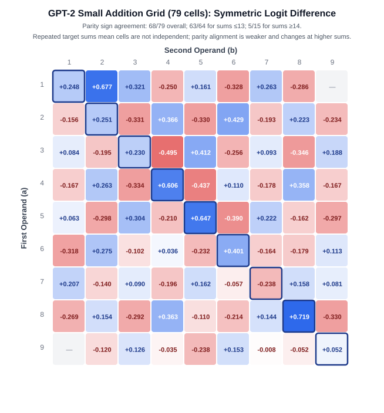

# Arithmetic Prompt Processing in GPT-2 Small: Auditing Circuit Claims and an Equal-Operand Preference

**Anay Katiyar**  
Independent Researcher  

---

## Abstract

We tested whether GPT-2 Small (124M parameters) uses a general addition-specific mechanism on simple decimal addition prompts. The evaluated suite does not establish such a mechanism: top-1 accuracy was 2/32 (6.25%) on the held-out zero-shot cohort, compared with 8/32 (25%) for its best constant guess. Across the 79-cell addition grid, parity predicted the sign of the measured logit difference in 68/79 cells, but the pattern was concentrated at sums ≤13 (63/64) and weak at sums ≥14 (5/15); cells share target sums and are not independent. A target-dependent equal-operand pattern is present in the saved digit-addition scores (mean advantage +0.2474 across seven targets; exact sign-flip p = 0.03125; 95% target-bootstrap interval [+0.0738, +0.4374]), but the estimate is sensitive to target and control choices: sign-test and neighbor-token exclusion p-values are both 0.125. Corrected attribution accounts for final LayerNorm scaling and unembedding bias. The archived raw corpus log contains 79 requests and no errors; its no-floor summary shows positive joint log ratios at all seven targets and mixed conditional ratios. No association test was run; earlier correlation summaries are historical and the corpus-frequency relationship remains unresolved. These results do not establish a universal operator-blind mechanism or the absence of arithmetic-related representations in GPT-2 Small.

---

## 1. Introduction

A central objective of mechanistic interpretability is reverse-engineering the neural circuits responsible for algorithmic reasoning in transformer language models (Elhage et al., 2021; Olsson et al., 2022; Wang et al., 2022). Arithmetic tasks—such as single-digit addition—have frequently served as model organisms for studying representation learning, numerical binding, and modular arithmetic circuits (Nanda et al., 2023; Zhong et al., 2023). In small, pretrained language models like GPT-2 Small (Radford et al., 2019), preliminary probing frequently suggests identifiable circuits: attention heads attending to operand tokens, late-layer multi-layer perceptrons (MLPs) promoting correct digits, and apparent head-level suppressors regulating logit outputs.

Interpreting model internals without statistical controls and numerical error accounting carries substantial risk. We evaluated GPT-2 Small on prompts of the form `a + b =`. The supplied clean-rerun exports document the analyses; the raw corpus API response records are archived. Format and operator scores are exported as target-level summaries rather than complete prompt-level tables.

Our initial investigations appeared to support a structured heuristic addition pathway. Yet, systematic methodological auditing revealed that several headline observations were artifacts of:
1. **Unscaled Direct Logit Attribution (DLA)**: Neglecting final LayerNorm scaling inflated the displayed component attributions. The raw/corrected pairs in Table 2 imply a factor near $19.2$; the broader $14\times$–$40\times$ range in earlier wording is not supported by those pairs.
2. **Zero-Ablation Off-Distribution Shifts**: Forcing activation tensors to zero, which inflates residual stream standard deviation $\sigma$ from $19.20$ to $23.13$ and uniformly depresses all tracked logits by $\approx 1.0$, creating spurious "suppressor" heads.
3. **Token Geometry and Parity Confounds**: Conflating task-specific computation with intrinsic token-level biases, such as numerical parity preferences and static unembedding biases ($b_U$).

After these checks, a target-level equal-operand contrast remained. Exact sign-flip inference is nominally significant across the seven tested targets, while paired format comparisons show a difference between digit+digit and digit+word after Holm correction. Plus-versus-other operator comparisons do not detect a difference after correction, which is not evidence of equivalence. These results do not identify the mechanism or rule out broader operator-sensitive explanations.

---

## Research Question and Evidence Path

This study asks whether GPT-2 Small's apparent preference for correct answers on simple addition prompts reflects a general, addition-specific internal mechanism. The competing explanations include token-level output preferences, prompt structure, repeated operands, and other learned associations. The experiments were intended to distinguish these accounts rather than to treat every positive logit difference as evidence of a circuit.

The investigation began with an apparent addition-related signal. Correcting the attribution calculation changed its scale; separating the unembedding bias changed how some net outputs were interpreted; broader controls weakened several component-specific explanations. A target-dependent equal-operand advantage remained, but it also appeared under the tested non-addition operators and connectors. That result narrows the addition-specific interpretation without identifying the mechanism behind the remaining effect.

The experimental order was: behavioral baseline, matched controls, token and unembedding baselines, corrected Direct Logit Attribution (DLA), candidate interventions, doubles comparison, operator and connector substitutions, and a corpus-proxy audit. The final causal validation step remains proposed work. The question, prediction, measurement, result, interpretation, limitation, and next step for each stage are summarized in [docs/RESEARCH_FLOW.md](../docs/RESEARCH_FLOW.md). The literature-to-claim and data-source map is in [docs/LITERATURE_MAP.md](../docs/LITERATURE_MAP.md); the detailed correction record is in [docs/audit_trail.md](../docs/audit_trail.md).

The closest published comparison is Hanna et al.'s analysis of a different mathematical behavior in GPT-2 Small: greater-than prediction in year-like contexts. Work on trained modular-addition transformers supplies useful methodological and conceptual comparisons, but those settings differ from this pretrained decimal-addition benchmark. These sources motivate careful task definition and validation; they do not supply evidence for the measurements reported here.

---

## 2. Baseline Competence: The M1 Benchmark

Before attributing internal representations to an "addition circuit", one must establish whether the model actually solves the task. We evaluated GPT-2 Small across a standardized cohort of single-digit addition prompts ($N=36$, $a, b \in [1, 9]$, $a + b < 10$).

The notebook includes the top-five token output for the clean `3 + 5 =` prompt. It is a single-prompt diagnostic, not a cohort-wide token-ranking result. The broader cohort-level M1 tables are reported separately below.

Although the logit difference between target (` 8`) and foil (` 9`) is positive ($+0.6443$), the model fails to output `' 8'` in its top predictions. Table 1 summarizes the model's accuracy across full vocabulary and subset selections.

**Table 1: Task performance across zero-shot and few-shot addition cohorts.**

| Metric | Zero-Shot, all pairs ($N=36$) | Zero-Shot, held-out ($N=32$) | Few-Shot, held-out ($N=32$) | Reference |
|---|---|---|---|---|
| **Top-1 Full Vocabulary** | 2/36 (5.56%) | 2/32 (6.25%) | 2/32 (6.25%) | — |
| **Top-3 Full Vocabulary** | 5/36 (13.89%) | — | — | — |
| **Top-1 Among Answer Digits** | — | 12.5% | 31.2% | 14.3% (uniform over 7 digits) |
| **Best Constant Guess** | — | 8/32 (25%; answer 9) | 8/32 (25%; answer 9) | 25% on held-out cohort |
| **Strict Correctness Filter ($\tau=1.0$)** | 1/36 (2.78%) | — | — | Earlier few-shot cohort: 5/33 |

The all-pairs and held-out zero-shot cohorts use different prompt sets: 2/36 is 5.56%, while the held-out result is 2/32 (6.25%). The 25% constant-guess rate is 8/32 on the held-out cohort. Held-out few-shot performance is 2/32; the separate 5/33 few-shot result uses a different prefix and exclusion set. The strict-filtered subset is outcome-selected, so attribution on that subset is descriptive. These task-specific results do not establish that GPT-2 Small contains no addition-related representations or computations.

---

## 3. Testing Candidate Addition Mechanisms

### 3.1 Direct Logit Attribution and the LayerNorm Scaling Correction
Direct Logit Attribution (DLA) projects component activations onto the unembedding direction $W_U[:, \text{target}] - W_U[:, \text{foil}]$. In the reported evaluation, component projections summed to $\approx +8.95$ against a reported logit difference of $+0.6443$. The saved notebook output reports this analysis; the activation cache is not available as a standalone artifact.

This discrepancy arose because component activations were extracted prior to final LayerNorm. Under `fold_ln=True`, final LayerNorm computes:
$$x_{\text{normalized}} = \frac{x - \mu}{\sigma_{\text{final}}}$$
where $\sigma_{\text{final}} = \text{ln\\_final.hook\\_scale}$. The displayed raw/corrected component pairs imply a scale factor near $19.2$ (e.g., MLP 11 raw attribution $+2.6263 \to$ corrected $+0.1368$). The earlier $14\times$–$40\times$ range is not supported by the pairs shown here.

Furthermore, the static unembedding bias term $b_U[\text{target}] - b_U[\text{foil}]$ sits outside residual decomposition. Incorporating both corrections satisfies the exact sum identity to within $< 10^{-3}$:

$$\sum_{i=1}^{159} \text{DLA}_i + \left( b_U[\text{target}] - b_U[\text{foil}] \right) = \text{logit\\_diff}$$

**Table 2: Corrected DLA decomposition on prompt `"3 + 5 ="` (Target `' 8'`, Foil `' 9'`).**

| Component | Unscaled DLA (Superseded) | Corrected DLA | Verification Identity |
|---|---|---|---|
| **MLP 11** | +2.6263 | +0.1368 | Sum Heads: +0.2172 |
| **MLP 7** | +2.2342 | +0.1164 | Sum MLPs: +0.2031 |
| **MLP 8** | +1.1474 | +0.0598 | Embed + Pos + Bias: +0.0455 |
| **MLP 10** | -2.2538 | -0.1174 | **Residual Sum: +0.4658** |
| **Head L11H1** | +0.9763 | +0.0509 | $b_U[\text{8}] - b_U[\text{9}]$: +0.1782 |
| **Head L11H0** | -0.8608 | -0.0448 | **Reconstructed: +0.6440** |
| **Head L9H1** | +0.5762 | +0.0300 | **Measured Logit Diff: +0.6443** |

### 3.2 The Static-Bias Override
For the few-shot Run 2 comparison on `158 + 274 =` (target `' 8'`, foil `' 1'`), the dynamic contribution was $+0.8382$ and the logit difference was $-0.1920$. The static bias term, $b_U[\text{8}] - b_U[\text{1}] = -1.0303$, accounts for the sign difference algebraically. Since the arithmetic answer is 432, this is a token-contrast identity, not evidence that an addition circuit computed 8 and was overridden. The DLA analysis uses explicit prompt-specific logits and cache variables for this comparison.

### 3.3 Zero-Ablation Artifacts vs. Mean-Ablation Additivity
Zeroing the output of head L11H0 caused logit difference to rise by $+0.0658$, leading to its early characterization as an active "suppressor head". Tracking the residual stream standard deviation $\sigma$, however, revealed that zero-ablation forced $\sigma$ from $19.2002$ to $23.1286$, inducing an unphysiological shift that depressed all vocabulary logits uniformly by $\approx 1.0$.

When replaced with mean-ablation across seven reference prompts (four arithmetic and three generic text), the reported L11H0 shift was $+0.0013$ ($\sigma = 19.0148$). Joint ablation of L11H0 and MLP10 yielded a reported logit difference of $+0.8127$, compared with an additive prediction of $+0.8131$; their difference is $-0.0004$ on this prompt. This result does not support the earlier non-additive suppressor interpretation for this prompt. The earlier exploratory outputs are summarized in the audit trail; the final saved notebook is [`notebooks/00_full_record.ipynb`](../notebooks/00_full_record.ipynb).

---

## 4. The Doubling Anomaly

Because the tested benchmark provides no positive evidence for a general, reliably functioning addition mechanism, we examined structured patterns in the addition grid. The 79-row grid and 39-row digit+digit score file show a target-dependent equal-operand preference. The supplied exports add target-level inference and paired comparisons across formats/operators. Complete prompt-level formatted and operator score tables are not included.

*Figure 1: Heatmap of symmetric logit differences across the 79 addition-grid rows. Parity sign agreement is 68/79 overall, 63/64 for sums ≤13, and 5/15 for sums ≥14 (0/9 for sums 14–15). Repeated target sums mean grid cells are not independent; the high-sum pattern differs from the lower-sum pattern.*

In a separate parity-control comparison across seven targets, the mean advantage is +0.1865 (exact sign-flip p = 0.140625; 95% target-bootstrap interval [−0.0068, +0.3863]). This interval includes zero and does not provide clear evidence of a positive mean under that control.

### 4.1 Dense Scan Evaluation
We conducted a dense scan across all even target sums $T \in [4, 16]$, evaluating double prompts ($d + d = T$) against all unique non-double single-digit splits ($a + b = T$, $a \ne b$) in both operand orders.

**Table 3: Dense scan metrics across even target sums.**

| Target ($T$) | Double Prompt | Ordered Control Prompts ($n$) | Double Score | Control Mean | Advantage |
|:---:|:---:|:---:|:---:|:---:|:---:|
| **4** | `2 + 2 =` | 2 | +0.251 | +0.203 | +0.049 |
| **6** | `3 + 3 =` | 4 | +0.230 | +0.213 | +0.017 |
| **8** | `4 + 4 =` | 6 | +0.606 | +0.315 | **+0.291** |
| **10** | `5 + 5 =` | 8 | +0.647 | +0.113 | **+0.535** |
| **12** | `6 + 6 =` | 6 | +0.401 | +0.236 | **+0.165** |
| **14** | `7 + 7 =` | 4 | -0.238 | -0.232 | -0.006 |
| **16** | `8 + 8 =` | 2 | +0.719 | +0.037 | **+0.682** |

These digit+digit values can be recomputed from [`data/current/doubles_scan_scores.csv`](../data/current/doubles_scan_scores.csv), which contains all 39 double and ordered-control prompt scores. The format-level means are in [`data/current/variance_scaling.csv`](../data/current/variance_scaling.csv); prior rounded values are summarized in [audit entry A23](../docs/audit_trail.md#a23-doubles-analyses). In the digit+digit summary, advantages are positive at 8, 10, 12, and 16 and near zero at 4, 6, and 14; this does not establish null effects across all formats. Format-specific mean double/control scores changed for targets 4, 6, and 14 while their advantages remained effectively unchanged. The formatted prompt-level scores needed to independently recompute all three formats' pooled SDs are not exported.

Across the seven target-level advantages, the mean is +0.2474. The exact two-sided sign-flip test gives p = 0.03125, and a 10,000-resample target bootstrap (seed 20261008) gives a 95% percentile interval [+0.0738, +0.4374]. Six of seven targets are positive (two-sided sign test p = 0.125), leave-one-target-out sign-flip values are 0.03125 or 0.0625, and excluding controls with operands T−1 or T+1 leaves six targets with mean +0.2561 and p = 0.125. The inference unit is the target level; these results do not establish generalization beyond the tested grid.

### 4.2 Invariance to Lexical and Format Variations
To test whether the doubling effect is driven by token-level repetition of identical surface strings, we evaluated cross-format variants: digit+word (`4 + four =`) and word+word (`four + four =`).

**Table 4: Mean matched equal-operand advantage across all seven target levels.**

| Format | Mean advantage | Paired comparison | Holm-adjusted p |
|---|---:|---|---:|
| digit + digit | +0.2474 | digit+digit vs digit+word | 0.046875 |
| digit + word | +0.4663 | digit+digit vs word+word | 0.21875 |
| word + word | +0.7218 | digit+word vs word+word | 0.21875 |

Paired comparisons use the seven matched target levels. Only digit+digit versus digit+word remains below 0.05 after Holm correction. The pattern does not establish a monotonic increase by verbalization or identify a mechanism. `adv/SD` remains descriptive; the current export contains target-level means rather than every formatted prompt score.

---

### 4.3 Exploratory Candidate-Component Screen

The clean-rerun component screen uses discovery target sums 4, 6, 10, 12, and 16. It names `10_mlp_out`, L9H9, and L10H2 as candidates for follow-up, not as a confirmed circuit. The candidate adjustment family contains 12 components. For the nominated candidates, one-sided causal tests have raw p = 0.03125 but one-sided FDR q = 0.09375; two-sided FDR q = 0.15. With five discovery targets, the minimum one-sided exact p is 1/32 = 0.03125, so the screen has limited resolution and a null finding is compatible with low power. No nominated component passes q < 0.05.

Activation patching reports modest, variable recovery. In the exploratory transfer check, joint ablation lowers the advantage at target 8 and raises it at target 14. Across the prospective range 24–36, the signed contrast change is negative at five targets and positive at two; the clean contrasts at targets 26 and 34 are already negative. The transfer is exploratory, and filler prompts also show effects. Target-level completeness ratios vary and become unstable when the full effect is small, so no aggregate removal fraction is used as a headline result.

## 5. Operator and Connector Substitutions

Does the equal-operand preference appear only with addition? An addition-specific account predicts that it should weaken when the operator changes. The comparison is limited to the tested prompt strings and target tokens.

*Figure 2: Mean matched target-level advantage by operator string across seven target sums. Plus-versus-other paired tests have Holm-adjusted p = 0.6875. The same sum token is scored for every string, so this does not test whether GPT-2 performs the non-addition operations; failure to detect differences does not establish equivalence.*

We evaluated all double and control prompts across 5 operator configurations, tracking logits strictly on the sum token $2a$:
1. Addition (`+`): `d + d =`
2. Multiplication (reported as `×` in the source records): `d × d =`
3. Subtraction (reported as `−` in the source records): `d − d =`
4. Conjunction (`and`): `d and d =`
5. Temporal Sequence (`then`): `d then d =`

**Table 5: Mean matched target-level advantage by operator/connector (seven targets).**

| Operator / connector | Mean advantage | Plus vs condition, Holm p |
|:---|---:|---:|
| plus (`+`) | +0.2474 | — |
| minus (`−`) | +0.1637 | 0.6875 |
| times (`×`) | +0.1515 | 0.6875 |
| and | +0.2840 | 0.6875 |
| then | +0.3243 | 0.6875 |

### Operator inference and interpretation
The supplied clean-rerun export contains matched target-level means for all five strings. Prompt-level operator scores are not included. The figure and table use those seven-target means, not the older aggregate adv/SD summary.

At target 8, saved advantages for `and` (+0.321) and `then` (+0.344) equal or exceed plus (+0.291), a descriptive observation consistent with the effect not being addition-specific. The paired plus-versus-other comparisons have Holm-adjusted $p=0.6875$. This does not show that the conditions are equivalent, and the same arithmetic sum token is scored under every string. Operator-position patching (A19) is a separate experiment and does not validate or invalidate these comparisons.

---

## 6. Pretraining Corpus Frequency Audit

The external corpus-frequency analysis is inconclusive. Sparse joint-query counts and the mismatch between the available proxy corpus and GPT-2's exact training distribution prevent strong conclusions about memorization. The results should therefore not be used either to establish or to rule out a memorization-based explanation.

We investigated whether the doubling anomaly is driven by verbatim co-occurrence frequencies in pretraining text. Using the Infini-gram API, we audited the open 3-trillion-token Dolma v1.7 corpus (`v4_dolma-v1_7_llama`) across all 7 target sums.

**Methodological Retraction**: An early preliminary query indicated a correlation between joint prompt-answer counts and model advantage ($\rho = +0.82$, $p = 0.023$). Audit inspection revealed that query tokenization formatting had produced 0 joint matches for higher targets, collapsing the ratio into a prompt-frequency artifact.

The supplied raw collector log contains 79 requests with zero errors and is archived in CSV and JSONL. The reconstructed no-floor summary shows positive joint log ratios at all seven targets and mixed conditional log ratios. The collector did not apply an eligibility floor or calculate a correlation. Earlier summaries ($\rho=+0.46$, $p=0.294$ for joint counts; $\rho=-0.14$, $p=0.760$ for conditional counts, $n=7$) remain historical. The earlier $\rho=+0.82$, $p=0.023$ remains retracted. Dolma is a proxy, not GPT-2's exact training corpus; the frequency relationship remains unresolved. See [the corpus audit](../docs/CORPUS_AUDIT.md).

---

## 7. Discussion and Related Work

The cited literature is used as methodological context, not as evidence for the present measurements. In particular, previous circuit studies show examples of mechanistic explanations on other behaviors; they do not establish that the same mechanism is present in this addition benchmark. See [the literature-to-claim map](../docs/LITERATURE_MAP.md) for source-by-source scope.

### 7.1 Static Heuristics vs. Algorithmic Circuits
The addition grid shows parity-sign agreement in 68/79 cells (86.1%) overall, but the rate is 63/64 for sums ≤13 and 5/15 for sums ≥14. This pattern does not support a uniform parity account across the grid. The audit reports an elevated target-10 baseline on one filler prompt; the four-template mean is recomputed by the diagnostic script and is not available as a committed output.

### 7.2 Methodological Lessons for Mechanistic Interpretability
This investigation illustrates several safeguards for this task:
1. **Account for final LayerNorm scaling** when projecting residual components into unembedding space.
2. **Compare interventions with distribution-preserving baselines**; zero-ablation changed residual-stream scale in the reported prompt.
3. **Use operator and connector controls**, while treating the result as evidence about only the tested strings and controls.

---

## 8. Conclusion

The reported evaluation suite does not establish a general, reliably functioning addition mechanism in GPT-2 Small. Several early mechanistic interpretations were weakened after methodological corrections. A target-dependent equal-operand preference is present in the committed grid and prompt-level digit-addition scan; the operator and connector summaries persist across the tested strings but remain bounded to their design. The corpus audit provides no association test and no prespecified eligibility rule. The archived raw API logs are available, while full prompt-level format/operator scores and the single-operand control remain absent. These limits constrain further conclusions. These experiments do not establish the absence of arithmetic-related representations or operator-sensitive mechanisms elsewhere in the model.

---

## AI Use Disclosure

Claude Sonnet 5.5, ChatGPT, and Gemini 3.1 Pro assisted with literature exploration, code, and writing. The author checked the reported data, calculations, citations, and claims against available records, code, and cited sources. Some results cannot be independently regenerated from the available materials. The author made the final research decisions and is responsible for the data, analyses, claims, citations, and manuscript.

---

## References

These references provide methodological context, not evidence for the study's measurements. See the [literature-to-claim map](../docs/LITERATURE_MAP.md) for source relevance and measurement records, and the [audit trail](../docs/audit_trail.md) for corrections and result status.

- Bolukbasi, T., et al. (2021). An Interpretability Illusion for BERT. *research draft arXiv:2104.07143*.
- Elhage, N., et al. (2021). A Mathematical Framework for Transformer Circuits. *Transformer Circuits Thread*.
- Hase, P., Bansal, M., Kim, B., and Ghandeharioun, A. (2023). Does Localization Inform Editing? Surprising Differences in Causality-Based Localization vs. Knowledge Editing in Language Models. *NeurIPS 2023*.
- Hanna, M., Liu, O., and Variengien, A. (2023). How does GPT-2 compute greater-than? Interpreting mathematical abilities in a pre-trained language model. *NeurIPS 2023*.
- Conmy, A., et al. (2023). Towards Automated Circuit Discovery for Mechanistic Interpretability. *NeurIPS 2023*.
- Nanda, N., Chan, L., Lieberum, T., Smith, J., and Steinhardt, J. (2023). Progress Measures for Grokking via Mechanistic Interpretability. *ICLR 2023*.
- Olsson, C., et al. (2022). In-context Learning and Induction Heads. *Transformer Circuits Thread*.
- Radford, A., et al. (2019). Language Models are Unsupervised Multitask Learners. *OpenAI Technical Report*.
- Wang, K., et al. (2023). Interpretability in the Wild: A Circuit for Indirect Object Identification in GPT-2 Small. *ICLR 2023*.
- Zhong, Z., et al. (2023). The Clock and the Pizza: Two Stories in Mechanistic Explanation of Neural Networks. *NeurIPS*.
